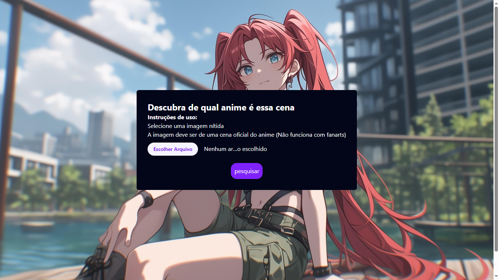
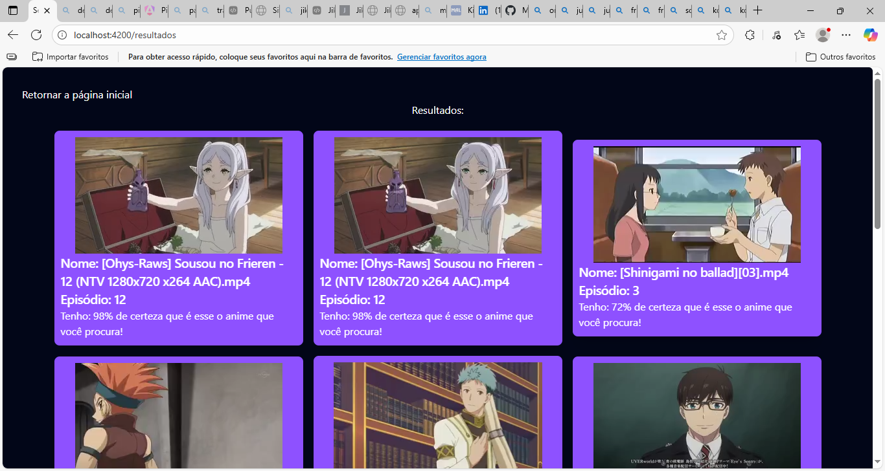

# 🧭 SearchScene  

  
  
  


Aplicação web que permite **identificar o nome do anime, episódio e outras informações** a partir de uma **imagem ou cena específica**.  

---

## 🧰 Tecnologias Utilizadas  

<ul>
  <li><strong>Angular 19</strong> – Framework principal para o desenvolvimento do front-end</li>
  <li><strong>Tailwind CSS</strong> – Estilização moderna e responsiva</li>
  <li><strong>Trace.moe API</strong> – Serviço usado para identificar animes a partir de imagens</li>
</ul>

---

## 💡 Como Usar  

Na página inicial, selecione a imagem desejada e clique em **Pesquisar**.  

<p align="center">
  
</p>

Em seguida, os resultados serão exibidos na página seguinte:  

<p align="center">
  
</p>

> ⚠️ **Observação:** Os resultados podem não ser 100% precisos, pois dependem do reconhecimento feito pela API Trace.moe.


## 🚀 Servidor de Desenvolvimento

Para iniciar o servidor local de desenvolvimento, execute o comando:

```bash
ng serve
```

Depois que o servidor estiver em execução, abra o navegador e acesse:
👉 `http://localhost:4200/`

O aplicativo será recarregado automaticamente sempre que você modificar algum dos arquivos de origem.

## 🧩 Geração de Código

O Angular CLI oferece ferramentas práticas para criar componentes, diretivas, pipes e outros elementos do projeto.

Para gerar um novo componente, use:

```bash
ng generate component nome-do-componente
```

Para ver a lista completa de *schematics* disponíveis:

```bash
ng generate --help
```

## ⚙️ Compilando o Projeto

Para compilar o projeto, execute:

```bash
ng build
```

Os arquivos compilados serão armazenados no diretório `dist/`.
Por padrão, o modo de produção gera uma versão otimizada, focada em **desempenho e velocidade**.

## 🧪 Testes Unitários

Para executar os testes unitários utilizando o [Karma](https://karma-runner.github.io):

```bash
ng test
```

## 🔍 Testes End-to-End (E2E)

Para executar testes de ponta a ponta:

```bash
ng e2e
```

> ⚠️ O Angular CLI não inclui por padrão um framework E2E.
> Você pode escolher e configurar o que preferir (por exemplo, Cypress ou Playwright).

## 📚 Recursos Adicionais

Para saber mais sobre o Angular CLI e seus comandos, consulte a documentação oficial:
🔗 [Angular CLI Overview and Command Reference](https://angular.dev/tools/cli)


## 👨‍💻 Créditos  

Desenvolvido com 💙 por **[Mateus](https://github.com/MateusSantoss)**  
📚 Estudante de **Tecnologia da Informação**, apaixonado por **programação** e **animes**.  

Se este projeto te ajudou de alguma forma, não esqueça de deixar uma ⭐ no repositório e me seguir para acompanhar novas atualizações! 🚀


